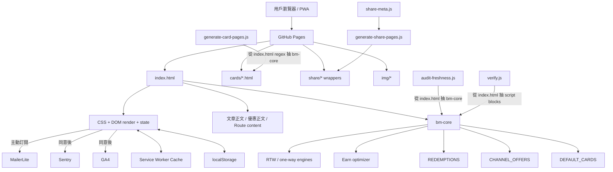
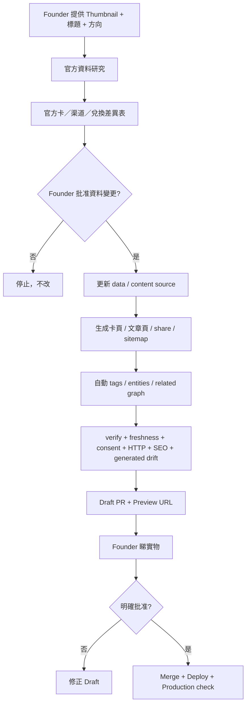

# AcreMiles Current Architecture Map v1

**審查日期：** 2026-07-22  
**審查模式：** 只讀 Repo Audit  
**Repository：** `lobakpei/Miles-`  
**正式分支：** `main`  
**基準 commit：** `fb63103778831688b89bf5e4b08dbe1882c2f354`  
**正式版本：** `v6.79.0`  
**`index.html` blob SHA：** `1eef80e8e4d480b98660bbb576afdee1afc67f43`  
**今次有冇改 Repo：** **冇。** 冇 commit、push、PR、merge 或 deploy。

---

## 2026-07-23 Phase 1A implementation delta

本文件正文係 `fb631037…` 嘅只讀歷史 audit，原始量度、圖同風險判斷保留不改，唔應被當成 Phase 1A 後嘅即時 file map。以正式 `main` `ba8f6db0b087275f63785468ccec424a9d5ad1e2` 為搬遷基準，Phase 1A 候選分支已完成以下責任切割：

| 責任 | Phase 1A Source of Truth | 使用者 |
|---|---|---|
| 銀行官方卡資料 | `data/cards-official.js` | `index.html`、optimizer、card generator、verify、regression lock |
| 申請渠道／平台額外優惠 | `data/card-channels.js` | `index.html`、freshness audit、verify、regression lock |
| 官方 audit sources 及核實紀錄 | `data/source-registry.js` | data aggregator、card generator、audit、verify；產品／申請 URL 仍跟 card runtime record |
| schema／runtime view | `data/index.js` | Browser 同 Node 共用，驗證 ID／slug／image／status／來源關聯 |

`generate-card-pages.js` 同 `audit-freshness.js` 已直接 import `data/`；generator 嘅 card ID／filename／image hardcoded maps 已移除。Structured records 已分層，但為維持零 drift，舊 mixed presentation prose 仍以明確 compatibility record 暫存。`index.html` 仍承載 engine、RTW、content 同 UI，所以本次只完成信用卡 structured data layer，唔代表後續分層已完成。靜態 parity 同未執行風險見 [`PHASE1A-DATA-MIGRATION-EVIDENCE.md`](PHASE1A-DATA-MIGRATION-EVIDENCE.md)。

---

# 0. 一句判斷

AcreMiles 現有架構**唔係亂到要重寫**；相反，佢已經有一套幾有價值嘅資料、逐浸計算引擎、RTW 引擎、驗證腳本、官方來源紀錄同安全發布流程。

真正問題係：

> **同一個 `index.html` 同時做緊 Database、Engine、CMS、UI、文章庫、狀態管理同部分合規文件。**

所以今日每加一張卡、改一篇文章、更新一個 Hero、調整一條規則，都有機會牽連全站。現時仍然運作到，但已經去到一個清晰分界：

> **下一步唔應該先轉框架；應該先將「唯一資料來源」由巨大 HTML 抽出。**

最安全、最值錢嘅第一刀係：

1. 先鎖定現有輸出快照；
2. 將**官方信用卡資料**同**申請渠道／Referral 資料**拆成兩個正式資料層；
3. 令卡頁 generator、freshness audit、推薦器同 UI 全部讀同一份資料；
4. 過程中完全唔改計算結果同畫面。

---

# 1. Audit 範圍

今次已只讀檢查：

- GitHub `main`
- `index.html`
- `docs/MASTER.md`
- `docs/HANDOFF.md`
- `docs/ARCHITECTURE.md`
- `docs/ROADMAP.md`
- `docs/ARCHITECTURE-SEO.md`
- `docs/PROJECT-STATUS.md`
- `docs/QA-REPORT-v6.79.0.md`
- `docs/WEEKLY-CARD-UPDATE.md`
- `docs/CARD-SOURCE-AUDIT.md`
- `AGENTS.md`
- `scripts/verify.js`
- `scripts/audit-freshness.js`
- `scripts/generate-card-pages.js`
- `.github/workflows/weekly-card-audit.yml`
- `share-meta.js`
- `manifest.json`
- `sw.js`
- `sitemap.xml`
- 生成後信用卡頁例子
- 上載嘅 `cards.zip`
- 上載嘅最新 `index (1).html`

## 1.1 未做嘅事

今次**冇**：

- 改任何程式碼
- 重新跑 GitHub Actions
- 重新跑完整 browser QA
- 重新核實銀行官網最新條款
- 建立 backend／Google Login
- 將任何文件 push 上 GitHub
- 判斷所有新產品決定已經落實

所以本報告係：

> **架構現況與改造次序判斷**

唔係：

> **新版本 QA 或資料更新報告**

---

# 2. 基準狀態

| 項目 | 現況 |
|---|---|
| 正式版本 | v6.79.0 |
| Hosting | GitHub Pages |
| Domain | `acremiles.app` |
| 技術 | Vanilla HTML／CSS／JavaScript |
| Backend | 冇 |
| Login | 冇 |
| 雲端資料庫 | 冇 |
| Client storage | `localStorage` + Cache Storage |
| PWA | 有 |
| Analytics | GA4，取得同意後先載入 |
| Error diagnostics | Sentry，取得同意後先載入 |
| Email | MailerLite，主動訂閱先傳送 |
| Deploy | 合併到 `main` 後由 GitHub Pages 發布 |
| Current card data date | 2026-07-20 |
| Current cards | 9 |
| Recommendable cards | 8 |
| Current channel offers | 8，當中 6 個 active |
| Current redemption references | 10 |
| Current oneworld carriers | 16 |
| Current airport records | 122 |
| Verified direct route records | 41 |
| Known no-direct records | 10 |
| Current spend scenarios | 3 |

## 2.1 `index.html` 實際規模

| 指標 | 數值 |
|---|---:|
| File size | 656,623 bytes |
| Lines | 7,318 |
| Inline CSS blocks | 1 |
| Inline CSS characters | 107,843 |
| Script blocks | 7 |
| `bm-core` characters | 74,130 |
| Main UI／state script characters | 199,143 |
| Main tabs | 5 |
| Overlay pages | 23 |
| DOM IDs | 206 |
| `<details>` elements | 67 |
| `bm_*` storage keys | 16 |

現有文件仍寫住約 622KB／6,886 行，證明架構文件數字已經開始追唔上實際 `main`。呢個唔係大錯，但係一個明確信號：

> **單一大檔案繼續增長，手動文件會愈來愈難同步。**

---

# 3. 現時系統圖



---

# 4. Repository 現況地圖

```text
/
├── index.html
│   ├── HTML 頁面
│   ├── 全站 CSS
│   ├── 信用卡正式資料
│   ├── 申請渠道優惠
│   ├── 兌換資料
│   ├── Earn optimizer
│   ├── RTW / one-way engine
│   ├── 首頁 scenarios
│   ├── 攻略 / 優惠 / Route 正文
│   ├── UI render
│   ├── localStorage state
│   ├── 分享 / 收藏
│   ├── consent / analytics
│   └── PWA / settings logic
│
├── share-meta.js
│   └── 20 個內容 metadata；正文唔喺呢度
│
├── cards/
│   └── 由 index.html 主卡庫生成嘅 9 張卡 + index
│
├── share/
│   └── 文章 / 路線 / 優惠 OG redirect wrappers
│
├── img/
│   └── Hero、文章、Route、分享圖
│
├── scripts/
│   ├── verify.js
│   ├── test-consent-gate.js
│   ├── audit-freshness.js
│   ├── generate-card-pages.js
│   ├── generate-share-pages.js
│   ├── smoke-http.js
│   ├── test-social-previews.js
│   ├── browser-qa.js
│   └── update-build-marker.js
│
├── docs/
│   ├── MASTER.md
│   ├── HANDOFF.md
│   ├── ARCHITECTURE.md
│   ├── ROADMAP.md
│   ├── CARD-SOURCE-AUDIT.md
│   ├── WEEKLY-CARD-UPDATE.md
│   ├── QA reports
│   ├── RTW audits
│   └── legal / retention / content compliance
│
├── .github/workflows/
│   └── weekly-card-audit.yml
│
├── manifest.json
├── sw.js
├── sitemap.xml
├── robots.txt
├── CNAME
└── AGENTS.md
```

---

# 5. 現時 Source of Truth Matrix

| 資料／功能 | 現時 Source of Truth | 生成／使用方式 | 主要風險 |
|---|---|---|---|
| 官方信用卡資料 | `index.html` → `DEFAULT_CARDS` | App、optimizer、generator、audit | 同 UI 綁死；欄位來源粒度不足 |
| 卡詳情長文 | `index.html` → `publicDetails` | App + generated card pages | 改資料要改巨大 HTML |
| 申請渠道優惠 | `index.html` → `CHANNEL_OFFERS` | App + freshness audit | 同官方資料物理上未分層 |
| 信用卡靜態頁 | `cards/*.html` | generator output | generator 有 hardcoded card/file map |
| 兌換參考 | `index.html` → `REDEMPTIONS` | 點用結果 | 未有正式年度現金票價資料模型 |
| 單程／RTW 規則 | `index.html` → `bm-core` | Engine + UI | 巨大資料與引擎耦合 |
| Zone 10 正式線 | `docs/ZONE-10-ROUTE.csv` + index data | verifier cross-check | 只有 Zone 10 有獨立 machine-readable base |
| 攻略／優惠正文 | `index.html` hidden overlay | App render | 搜尋器唔直接讀到全文 |
| 文章 metadata | `share-meta.js` | wrapper generator | 正文同 metadata 分開，可能 drift |
| 文章分享頁 | `share/*` | generated redirects | `noindex,follow`，唔係 SEO 正文頁 |
| Sitemap | `sitemap.xml` | static | 目前主要只有 root + cards |
| 首頁示範 | `index.html` → `SPEND_SCENARIOS` | homepage render | 冇獨立 source link / schema |
| PWA core assets | `sw.js` 手動清單 | service worker | 新增／刪除資產容易漏同步 |
| 本機資料 schema | `index.html` + verifier | localStorage | 新增功能要手動同步 reset gate |
| 版本 | build marker + JS + settings + SW | verifier | 四處同步，仍屬手動 |
| 產品決定 | MASTER / HANDOFF / Handoff doc | AI / Work 讀取 | 2026-07-22 最新決定未全部入 repo |

---

# 6. 已經做得好，應該保留嘅部分

## 6.1 Safety / Release Discipline

Repo 已經有：

- Backup branch / immutable tag / ZIP 規則
- 未批准不可 merge / deploy
- 版本四處一致 gate
- rollback 方法
- 正式 QA 報告
- repo-level `AGENTS.md`

呢套安全文化係資產，唔應該因為重構而削弱。

## 6.2 「逐浸」引擎已經存在

現有 Engine 唔係簡單「揀邊張卡」。

佢已經：

- 將累積迎新門檻拆成邊際浸
- 計每浸新增消費／新增里數
- 發現後浸效率比前浸高時合浸
- 先比較較高效率浸
- 處理 tiered、threshold、feePurchase
- 處理 cap 同 excess rate
- 支援排除卡、現有卡、家庭模式

所以唔應該重寫引擎由零開始。

正確做法係：

> **先將現有引擎抽出成可直接測試嘅 module，再按最新產品決定逐項加規則。**

## 6.3 官方來源基礎已經存在

9 張卡已經有：

- 官方產品頁
- KFS
- 迎新 T&C
- 官方獎賞／兌換資料
- 核實日
- 公開詳情分類

卡頁 generator 已經能輸出相當完整嘅 SEO card page。

## 6.4 Official Card Layer / Channel Layer 概念已經有雛形

現有：

- `DEFAULT_CARDS`
- `CHANNEL_OFFERS`

已經概念上接近用戶最新決定：

1. 官方卡資料層
2. 平台／Referral 渠道層

問題只係佢哋仍然一齊塞喺 `index.html`，未正式 schema 化。

## 6.5 Freshness Audit 已經有基礎

現有每週 workflow 會：

- 星期一香港 08:00 執行
- 檢查 active 渠道優惠 expiry
- 檢查官方 welcome deadline
- 檢查卡資料幾多日冇重新核實
- strict 模式有 warning 就顯示失敗

呢個係好開始，應保留並升級，而唔係另起一套。

## 6.6 Generated Outputs

`cards/` 同 `share/` 已經係 generated outputs 概念。

下一步只需要令 generator 從獨立 data/content 讀取，唔再用 regex 入巨大 HTML 搵資料。

## 6.7 Local-first / Consent

現時：

- 核心資料先留本機
- GA / Sentry 明確同意先載入
- Email 主動提交先傳送
- reset 會清 `bm_*`

呢個基礎應該保留，即使日後加可選 Google Login。

---

# 7. 主要風險與缺口

## P0 — 資料可信度

### P0.1 Engine 入面仍有「市場整理，待官方」規則

`BANK_SECOND_CARD_RULE` 目前包含：

- Citibank = 0
- 滙豐 = 0.25
- 美國運通 = 0.65

而原始註解清楚寫住部分係：

> 「市場整理，待官方」

呢個同最新決定：

> **所有會影響計算結果嘅信用卡規則，只接受官方資料**

有直接衝突。

**建議：**

- 卡層有官方 `altTiers` / `secondCardMult` 先使用；
- 冇官方依據，就唔應用銀行級推測乘數；
- 欄位標記 `unknown`，唔好用看似精確嘅 0.25 / 0.65 代替未知。

### P0.2 整卡 `verified: true` 太粗

現時一張卡可以整體 `verified: true`，但卡內仍可能有：

- 完整排除交易未建模
- 上限未見官方明文
- 新客定義未完全結構化
- 渠道額外獎賞可能到期
- 某個 rate 只係保守值

所以需要將會影響推薦嘅欄位逐項變成：

```js
{
  value,
  sourceUrl,
  sourceDocument,
  sourceLevel: "official-product | official-tnc | official-kfs | platform",
  verifiedAt,
  validFrom,
  validUntil,
  status: "verified | unknown | expired | conflict"
}
```

`recommendable` 應該由必要欄位推導，唔係人手寫一個總綠勾。

### P0.3 官方層同渠道層未真正隔離

概念上分開，程式上仍同一 block。

風險：

- 第三方平台數字誤入官方資料
- generator / UI 唔容易知道邊個數字屬銀行、邊個屬平台
- 將來 AcreMiles referral 會更容易混亂

### P0.4 首頁 Scenario 冇正式來源 schema

目前 `SPEND_SCENARIOS` 只有：

- amount
- reward miles
- reward example
- sourceDate
- verified boolean

但缺少：

- 官方商品價格來源
- 使用咗邊幾張卡／邊幾浸
- 官方卡條款來源
- 兌換表來源
- `validUntil`
- 計算 snapshot / engine version
- 真實案例 vs 可行示範類型

而 Hero 係最當眼位置，反而應該係來源最完整嘅地方。

### P0.5 Redeem Value Engine 尚未有資料地基

最新產品決定係：

- 按過去一年平均現金票價排序
- 顯示現金參考價及更新日期
- 價值最高優先
- 再以剩餘里數最少、震撼度排序
- V1 支援 Asia Miles + Avios
- 一人／二人／家庭
- RTW 獨立分流

現有 `REDEMPTIONS` 只有少量固定 `cashCost` / route / cabin 參考，未有：

- 12 個月平均票價
- 取樣方法
- 來源
- 取樣日期範圍
- 艙等一致性
- 直航／轉機
- 機場 mapping
- Asia Miles / Avios 多方案
- 每人數量推導

因此「點用」新版本唔可以只靠現有 `REDEMPTIONS` 小修 UI，要先建正式 redemption schema。

---

## P0 — 產品決定未入 Canonical Repo

### P0.6 Product Blueprint v2 未在 GitHub `main`

本次檢查：

- `docs/ACREMILES_PRODUCT_BLUEPRINT_V2.md`：Repo 內不存在
- 最新 2026-07-22 大量決定亦未完整寫入 MASTER / HANDOFF / ROADMAP

結果係：

> Work 如果只讀 GitHub，仍然會按 7 月 21 日舊理解做嘢。

例如 canonical docs 仲有：

- 由目的地出發
- 大額消費
- Calculator / Planner 舊命名
- Beginner / Advanced planner gateway 舊結構

而最新決定已經係：

- 點賺／點用
- 消費係入口，旅行係結果
- 單程／來回同 RTW 第一層分流
- RTW 入面先分簡易／進階
- Hero 三個可行案例
- Profile Hub
- Wallet / optional cloud sync
- Result / Opportunity Engine
- 官方卡層 + referral channel 層
- Tag graph / auto-related content

**呢個係最先要補嘅文件缺口。**

---

## P1 — 架構耦合

### P1.1 `index.html` 責任過多

目前一次改動可能同時碰到：

- 資料
- Engine
- UI
- 文章
- SEO
- PWA cache
- localStorage
- consent
- share
- version

影響：

- Merge conflict
- Work 對話負擔
- Runtime regression
- Review diff 太長
- 小改難以驗證
- 移動裝置編輯困難

### P1.2 Generator 依賴 regex 從 HTML 抽資料

`generate-card-pages.js`、`audit-freshness.js`、`verify.js` 都會：

> 先打開 `index.html` → 搵 `<script id="bm-core">` → 執行／抽資料

呢個接口脆弱：

- 改 script tag / module 形式就壞
- 資料格式同 HTML 結構耦合
- generator 唔可以獨立 import schema
- 測試唔係直接測 source module

### P1.3 Card generator 有 hardcoded map

新增一張卡，目前除咗加 data，仲可能要手動改：

- `fileById`
- `imageById`
- sitemap
- generated page
- app content
- FAQ / article references
- share metadata

理想情況應該係卡本身有：

```js
slug
image
seo
status
```

Generator 唔應該另外維護一張 ID map。

### P1.4 文章正文同 metadata 雙重維護

- 正文喺 `index.html`
- title / description / image / expire 喺 `share-meta.js`
- share wrapper 再生成一份
- sitemap 又係另一份

同一篇文章有幾個同步點，容易出現：

- Title 改咗，OG 未改
- Expiry 改咗，正文未灰
- Thumbnail 改咗，share 未改
- Article delete 後 wrapper 留低

### P1.5 Service Worker 資產清單手動維護

每多一張圖／頁，都可能要更新 `CORE`。

建議由 build / generator 自動產生 cache manifest，或者最少由 verifier 比對實際必要資產。

### P1.6 冇完整 PR CI

目前只有：

> Weekly card freshness audit

未有每個 PR 自動跑：

- verifier
- consent
- freshness
- generated drift
- HTTP smoke
- broken links
- SEO schema
- browser smoke

現時測試本身唔差，但主要依賴人或 Work 記得執行。

---

## P1 — SEO / Content

### P1.7 攻略／優惠正文唔係真正 SEO 頁

目前 share wrapper：

- 有 OG
- 有 canonical
- redirect 入 App overlay
- `noindex,follow`

搜尋器毋須執行 JS 時，讀唔到真正文章全文。

而 sitemap 目前主要列：

- Home
- cards

冇真正：

- `/guides/<slug>/`
- `/offers/<slug>/`
- `/rtw/<slug>/`

所以 SEO 入口同 Academy 產品架構仍未真正連成一體。

### P1.8 未有正式 Tags / Entity Graph

最新決定要求：

- 共用 tags
- 自動相關文章
- 自動相關卡
- 自動相關優惠
- 自動相關工具
- 文章內 entity linking

現時文章主要係人手 `data-open` 互連，未有正式 graph。

---

## P1 — Account / Cloud Sync

### P1.9 Google Login 唔係只加一粒掣

技術上可以喺 GitHub Pages 靜態站加：

- Google Auth
- Firebase / Supabase 類雲端資料庫

但一接雲端，就要新增：

- account ID
- server-side access rules
- data schema
- encryption / transport
- retention
- deletion
- export / subject access
- merge local data into cloud
- Last Modified Wins
- logout behavior
- offline queue
- conflict timestamp
- breach response
- updated privacy policy
- updated consent / account terms

因此可以做，但應該係：

> **資料 model 穩定之後嘅獨立工程**

唔應該同第一次 data extraction 一齊做。

---

## P2 — Copy / Product Drift

### P2.1 Manifest 仍然係舊定位

`manifest.json` description 仍然講：

> 大額消費、結婚、裝修、大旅行

同新中心思想：

> 每筆消費，都值得有回報

未一致。

### P2.2 Bottom Navigation 名稱未同步最新決定

目前仍係：

- 計算
- 規劃
- 首頁
- 優惠
- 攻略

最新決定係：

- 點賺
- 點用
- 首頁
- 優惠
- 攻略

### P2.3 Welcome Timing 未同步

現時程式 2 秒後先 fade；最新決定係約 0.8–1.2 秒。

### P2.4 Hero Flow 未同步

現時：

- 3 個舊 scenario
- 「用呢個金額計」
- 「睇計法」
- 入點賺後只帶入金額再 focus input
- 未自動出結果

最新決定係：

- V1 三個 Hero：iPhone 17 Pro Max 2TB、買車、結婚
- 真實可行、有完整來源
- CTA：「點做到？」
- 帶入金額後直接出完成 Demo result
- 用戶喺 Demo 上修改

### P2.5 Profile Hub 未存在

現時 header 仍有：

- FAQ / 小助手
- 更多

最新決定係合成一個 Profile / Avatar：

- 我的信用卡
- 我的旅程
- 我的收藏
- 跨裝置同步
- FAQ / 小助手
- 設定

---

# 8. 最小可行 Target Architecture

現階段唔需要 React / Next.js。

可以繼續：

- Vanilla JS
- GitHub Pages
- 無 bundler
- 現有 Design Language
- 現有 generator / tests

只要先將責任拆清楚。

```text
/
├── index.html
│   └── 只保留 App shell、頁面容器、必要載入次序
│
├── data/
│   ├── cards-official.js
│   ├── card-channels.js
│   ├── card-schema.js
│   ├── spend-scenarios.js
│   ├── redemptions.js
│   ├── destinations.js
│   ├── rtw-airports.js
│   ├── rtw-routes.js
│   └── source-registry.js
│
├── engine/
│   ├── earn.js
│   ├── opportunity.js
│   ├── redeem.js
│   └── rtw.js
│
├── content/
│   ├── guides/
│   │   └── *.md
│   ├── offers/
│   │   └── *.md
│   ├── rtw/
│   │   └── *.md
│   ├── tags.js
│   └── entities.js
│
├── app/
│   ├── storage.js
│   ├── analytics.js
│   ├── consent.js
│   └── sync.js              # 後期先加入
│
├── ui/
│   ├── earn.js
│   ├── redeem.js
│   ├── home.js
│   ├── offers.js
│   ├── guides.js
│   ├── profile.js
│   └── card-detail.js
│
├── scripts/
│   ├── generate-card-pages.js
│   ├── generate-content-pages.js
│   ├── generate-share-pages.js
│   ├── generate-sitemap.js
│   ├── generate-sw-manifest.js
│   ├── audit-freshness.js
│   ├── verify.js
│   └── ...
│
├── cards/                   # generated
├── guides/                  # generated full SEO pages
├── offers/                  # generated full SEO pages
├── rtw/                     # generated full SEO pages
├── share/                   # generated
└── img/
```

## 8.1 最重要界線

### 官方信用卡資料

```js
cardsOfficial
```

只接受：

- 銀行產品頁
- KFS
- 官方迎新 T&C
- 官方獎賞條款
- 官方收費表

### 申請渠道／Referral

```js
cardChannels
```

可以包括：

- 銀行官方申請
- MoneyHero
- MoneySmart
- 小斯
- 里先生
- AcreMiles referral（將來）

但呢層只講：

- 額外獎賞
- 申請 URL
- 優惠期限
- 平台條件

唔可以反過來修改官方卡規則。

---

# 9. 建議改造次序

## Phase 0 — 鎖定真相，完全唔改產品輸出

### 目的

避免「搬資料」同「改產品」混埋，出錯後唔知邊樣造成。

### 工作

1. 將 Product Blueprint v2 加入 Repo。
2. 將 2026-07-22 已確認決定整理成 `docs/DECISIONS-2026-07-22.md`。
3. 更新：
   - MASTER
   - HANDOFF
   - ROADMAP
4. 對現有 Engine 建立 fixtures：
   - 不同金額
   - 一人／二人
   - 已有卡
   - 排除卡
   - 年費設定
   - tiered / threshold / feePurchase
5. 保存：
   - optimizer outputs
   - card generated page hashes
   - key page DOM snapshots
   - storage schema
6. 加 generated drift check。

### 驗收

- 只改 docs / fixtures / CI helper；
- 正式 UI、數字、流程完全冇變；
- `main` 唔受影響，先開 Draft PR。

---

## Phase 1 — 拆官方卡資料與申請渠道

### 目的

建立第一個真正 Source of Truth。

### 搬出

```text
data/cards-official.js
data/card-channels.js
data/source-registry.js
```

### 同步改

- `index.html` 改為載入資料
- `generate-card-pages.js` 直接 import
- `audit-freshness.js` 直接 import
- `verify.js` 直接 import
- 移除 hardcoded `fileById` / `imageById`
- Card data 自己有 `slug` / `image`
- sitemap generator 由 card data 產生

### 明確唔改

- UI
- 推薦計算
- 卡排序
- 文案
- 里數結果
- localStorage
- Design Language

### 驗收

- 舊 fixture 全部一致
- 9 張卡頁可重生
- `git diff` 生成頁只得預期格式差異
- 所有 active channel 有 URL、expiry、verifiedAt
- 官方欄位唔再讀第三方數值
- 未有官方依據嘅 second-card 規則不再以精確乘數進推薦

---

## Phase 2 — 拆首頁 Scenario 與 Redeem Data

### 新檔

```text
data/spend-scenarios.js
data/redemptions.js
data/destinations.js
```

### Scenario schema 最少要有

```js
{
  id,
  title,
  officialRetailPrice,
  priceSource,
  priceVerifiedAt,
  earnInput,
  earnEngineVersion,
  resultMiles,
  resultSnapshot,
  redemptionId,
  validFrom,
  validUntil,
  status,
  type: "feasible-example | real-user-case"
}
```

### Redemption schema 最少要有

```js
{
  destinationId,
  displayName,
  airports,
  program,
  carrier,
  cabin,
  tripType,
  milesPerPerson,
  taxesEstimate,
  annualAverageCashFare,
  fareSamplePeriod,
  fareSourceMethod,
  fareVerifiedAt,
  directOrConnection,
  connectionPoint,
  status
}
```

### 驗收

- Hero / 點用結果只顯示有完整來源嘅資料
- 現金票價排序可重算
- UI 用人話，詳情層先顯示 IATA / carrier / connection

---

## Phase 3 — Content CMS / SEO

### 目標

你每星期只提供：

- Thumbnail
- 標題
- 文章方向
- 特別要求

其餘自動化：

- 寫正文
- SEO title / description
- 作者：畝 • 里
- Category / tags
- Entity links
- Related tools
- Related cards
- Related offers
- Related articles
- Related redemptions
- Full static page
- App content index
- OG
- sitemap
- expiry status

### 建議內容格式

Markdown + front matter：

```yaml
---
id: guide-credit-card-combo
slug: credit-card-combo
kind: guide
category: 信用卡組合
title: ...
author: 畝 • 里
image: ...
publishedAt: ...
updatedAt: ...
expiresAt:
tags:
  - HSBC
  - Asia-Miles
entities:
  - hsbc-everymile
cta:
  type: earn
---
```

### 生成

```text
content/*.md
  ↓
App article index
  ↓
/guides/<slug>/
/offers/<slug>/
/rtw/<slug>/
  ↓
share metadata
  ↓
sitemap
  ↓
related graph
```

---

## Phase 4 — 抽 Engine

### 搬出

```text
engine/earn.js
engine/opportunity.js
engine/redeem.js
engine/rtw.js
```

### Earn Engine

保留現有逐浸地基，加入已確認規則：

- 每里成本第一
- 總里數最大化
- Opportunity threshold
- 二人方案
- 年費卡候選
- 排除／恢復卡
- 官方新客規則
- 迎新利用率
- Timeline
- 即時重算

### Redeem Engine

加入：

- 一人／二人／家庭
- 來回預設
- Asia Miles + Avios
- RTW 獨立分流
- 過去一年平均現金票價
- 最高現金價值排序
- 剩餘里數最少
- 最震撼 fallback
- 推薦一個，詳情提供其他可行方案

### 驗收

- Engine 可由 Node 直接 import
- UI 唔需要執行先測到
- 同遷移前 fixture 比較
- 新規則每一條有獨立 test

---

## Phase 5 — UI V2

到呢一步先落實 2026-07-22 逐頁決定：

- Welcome 0.8–1.2 秒
- Consent scroll lock / reset
- Hero 3-card carousel
- CTA「點做到？」
- Demo result auto-run
- 點賺 slider / real-time result
- Result / cards / optimization / timeline
- 點用一人／二人／家庭
- RTW 分流
- Profile Hub
- Card transient detail view
- Wallet
- Collections
- 今日重點後置

**唔應該喺 Phase 1 搬資料時順手改晒呢啲。**

---

## Phase 6 — Google Login / Cloud Sync

先做 Data Mapping：

- user profile
- cards
- plans
- trips
- favorites
- settings
- timestamps
- deletion
- retention

再選 provider。

V1 sync policy：

- Anonymous local mode照用
- Google Login optional
- 第一次登入可將 local data merge 上雲
- Last Modified Wins
- Wallet 手動新增
- 唔收完整卡號、CVV、網銀資料
- 只存卡 ID、申請／批核／開卡／年費日期等需要資料

---

# 10. 每週更新理想流程



## 10.1 現時已做到

- 每週 freshness 提醒
- 官方 source audit
- 卡頁生成
- share wrapper 生成
- verifier
- consent test
- HTTP smoke
- browser QA script
- 安全 PR / release 規則

## 10.2 未做到

- 自動讀銀行新 PDF 並可靠判斷語意變更
- 文章單一內容來源
- 自動 tags / entity graph
- 真正 SEO full pages
- 全 PR CI
- 自動 GA weekly report
- Google cloud sync
- 自動 cash-fare dataset

## 10.3 GA 每週報告

GA 已經收數，但 Repo 未有 GA Data API integration。

要自動每週出報告，需要：

- GA property access
- service account / OAuth
- GA Data API
- GitHub Secrets 或另一個安全 runner
- 私隱限制
- report schema

所以現階段可以：

1. 先由你手動睇／匯出；
2. 網站 run smooth 後，再做自動 weekly report；
3. AI 只提出建議，唔自動改 Hero。

---

# 11. 第一個實際 Engineering Slice

我建議下一個 Draft PR 只做：

# Card Data Source Extraction v1

## Scope

1. 將 `DEFAULT_CARDS` 搬去 `data/cards-official.js`
2. 將 `CHANNEL_OFFERS` 搬去 `data/card-channels.js`
3. 加 `slug` / `image` 入 card data
4. Generator / audit / verifier 直接 import
5. 加 generated drift test
6. 加 optimizer fixtures
7. 清楚標示所有 `market整理／待官方` 規則
8. **唔改任何 UI、文案或計算公式**

## 點解係第一刀

因為佢同時解決：

- 每週更新
- 官方／Referral 分層
- 卡頁生成
- Source of Truth
- 新卡加入
- 日後 Wallet
- 日後 Profile
- 日後 cloud sync
- 日後 referral
- 日後欄位級核實

而風險低過先拆文章或先改 UI。

---

# 12. 第一個 PR 驗收條件

- [ ] `main` 先有安全備份
- [ ] 只喺獨立 feature branch
- [ ] 9 張卡完整
- [ ] 8 張 recommendable 狀態保持一致，除非移除未有官方依據嘅規則
- [ ] 所有官方 URLs 保留
- [ ] Channel offer URLs / expiry 保留
- [ ] Generated card pages 可重生
- [ ] `verify.js` PASS
- [ ] `test-consent-gate.js` PASS
- [ ] `audit-freshness.js` PASS / 只得真實 warning
- [ ] HTTP smoke PASS
- [ ] Optimizer fixture 結果一致
- [ ] Generated drift gate PASS
- [ ] UI 截圖與正式版一致
- [ ] Draft PR only
- [ ] 不 merge / deploy

---

# 13. 現階段明確唔好做

- 唔好一次過 React / Next.js 重寫
- 唔好一邊搬資料一邊重做 Hero
- 唔好一邊抽 Engine 一邊改排序公式
- 唔好將 Google Login 塞入第一次 data extraction
- 唔好整完整視覺 CMS 後台
- 唔好將第三方平台資料寫入官方卡欄位
- 唔好因為有免責聲明就保留未核實規則
- 唔好再讓新產品決定只留喺長對話
- 唔好直接改 generated `cards/*.html` 當 source
- 唔好令 Work 直接喺 `main` 大拆檔

---

# 14. Audit 結論

## 保留

- Vanilla / GitHub Pages
- Design Language
- 現有逐浸引擎
- RTW 引擎
- card page generator
- freshness workflow
- verifier / consent / smoke tests
- local-first
- expired history
- official source discipline
- safety / rollback process

## 優先修正

1. 最新產品決定入 Repo
2. 官方卡資料／渠道資料正式拆層
3. 欄位級來源狀態
4. 移除未有官方依據嘅精確乘數
5. Generator 唔再 regex 抽 HTML
6. PR CI
7. Scenario / redemption 正式 schema
8. Content single source + SEO full pages
9. Engine modules
10. 最後先 cloud sync 同大 UI iteration

## 最終判斷

AcreMiles 目前唔需要「推倒重做」。

佢需要嘅係：

> **保留已經有價值嘅 Engine，同時逐步將 Database、Content、Engine、UI 分家。**

第一步做啱之後，你每星期想要嘅營運模式先會真正成立：

> 你提供 Thumbnail、標題同方向；其餘資料核實、文章、Tags、內鏈、生成、QA、GitHub Draft PR 可以高度自動化。
