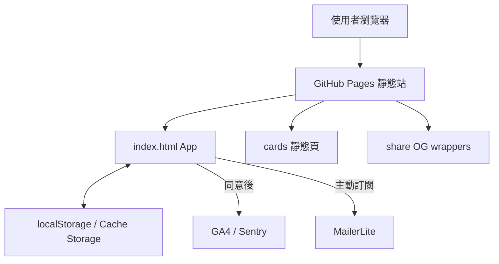
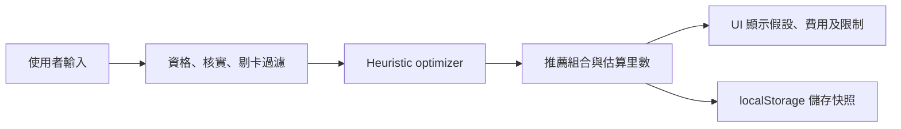
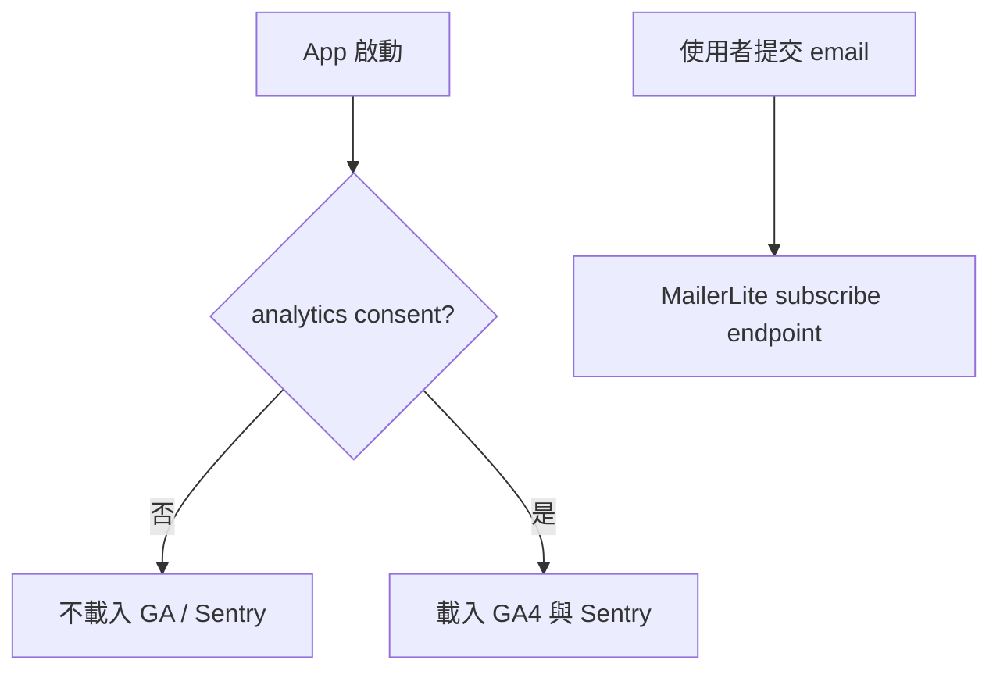

# AcreMiles Architecture

最後更新：2026-07-21  
基準版本：正式 v6.78.0；候選 v6.79.0-draft
本文件描述現行真實結構及未發布候選層；產品方向及安全規則以 [`ACREMILES_PRODUCT_HANDOFF_V1_1_SAFETY_HARDENED.md`](ACREMILES_PRODUCT_HANDOFF_V1_1_SAFETY_HARDENED.md) 為準，未來方向另見 [`ROADMAP.md`](ROADMAP.md) 同 [`ARCHITECTURE-SEO.md`](ARCHITECTURE-SEO.md)。

## 0. v6.79.0-draft 候選層

- `SPEND_SCENARIOS` 集中管理首頁「消費 → 里數 → 旅行結果」示範，只 render 已標記核實及未過期項目。
- 計算器保持同一引擎；UI 先問金額，再 reveal 篩卡條件同進階設定。
- `bm_saved_plans`／`bm_saved_trips` schema 只新增 optional `pinned` 欄位，舊資料無需 migration；低頻操作集中喺共用 bottom sheet。
- Beginner planner 只用現有 `OW_ZONE_DEMOS` 及 metadata 作 deterministic matching，再將結果載入原有 Advanced planner；冇 AI API、冇自由生成路線。
- `pgO2` 先加入 outcome-first tier 同 accordion；原有正文、條款及來源仍保留喺同一文章。
- 候選層只存在 feature branch；GitHub Pages 繼續由 `main` 部署，所以 Draft PR 本身唔會改 production。

## 1. 系統總覽

AcreMiles 係部署喺 GitHub Pages 嘅無後端靜態 PWA。主 App、卡資料、RTW 資料、文章內容、optimizer、CSS 同 UI 大部分集中喺 `index.html`。



冇登入、冇伺服器資料庫、冇 server-side API，亦冇為每個使用者動態產生圖片嘅服務。

## 2. 技術棧及部署

| 層 | 現況 |
|---|---|
| UI | Vanilla HTML、CSS、JavaScript |
| 主程式 | `index.html`，約 622KB／6,886 行／7 個 script blocks |
| PWA | `manifest.json`＋`sw.js` |
| Hosting | GitHub Pages＋`CNAME` → `acremiles.app` |
| Build system | 冇 bundler、冇 `package.json`、冇框架 build |
| 生成工具 | Node scripts 直接讀主卡庫及 `share-meta.js` |
| 自動化 | 每週信用卡 freshness GitHub Action；暫無完整 PR CI |
| Client persistence | `localStorage`、Cache Storage |
| External services | GA4、Sentry、MailerLite；受 consent／主動提交限制 |

GitHub Pages 部署來源係正式 `main`。repo 內冇 deployment workflow；每週 workflow 只做 read-only freshness audit。

## 3. Repository 地圖

```text
/
├── index.html                 # 主 App、主資料、引擎、內容、CSS、UI
├── share-meta.js              # 20 個文章／路線／優惠分享 metadata
├── cards/                     # 由主卡庫生成：9 張卡＋index
├── share/                     # 20 個現行內容 wrapper＋2 個 utility＋1 個撤回舊頁
├── img/                       # 文章、路線、banner、OG 圖
├── scripts/
│   ├── verify.js              # 最主要 release／可信度 gate
│   ├── test-consent-gate.js   # GA／Sentry consent runtime
│   ├── audit-freshness.js     # 優惠到期及來源新鮮度
│   ├── generate-card-pages.js # 從 bm-core 生成 cards/
│   ├── generate-share-pages.js# 從 share-meta 生成 share/
│   ├── smoke-http.js          # 所有本地 URL／資產 HTTP 檢查
│   ├── test-social-previews.js# FB／WhatsApp crawler metadata
│   ├── browser-qa.js          # Playwright／axe 核心流程
│   └── update-build-marker.js # 版本 marker helper
├── qa/                        # 歷史 browser 結果及基準截圖
├── docs/                      # 主交接、審計、QA、合規、roadmap、Zone 10 CSV
├── .github/workflows/
│   └── weekly-card-audit.yml  # 星期一香港 08:00 read-only audit
├── manifest.json
├── sw.js
├── sitemap.xml
├── robots.txt
├── CNAME
└── AGENTS.md                  # repo 級產品及 release 守則
```

## 4. `index.html` 內部責任

### 4.1 頁面及 UI

主要 tab：

- `tab-journey`：首頁／我的旅程／收藏。
- `tab-opt`：賺里數計算器、日常簽賬、卡庫。
- `tab-redeem`：里數兌換、RTW、單程參考。
- `tab-articles`：文章清單。
- `tab-guides`：關於／使用說明。

另有首次必讀、設定 sheet、訂閱 sheet、文章 overlay、卡詳情、機場 picker 同規則式 FAQ 助手。

### 4.2 純核心 `bm-core`

`var BM = (function(){ ... })()` 係目前最接近獨立 domain layer 嘅部分，包含：

- `DEFAULT_CARDS`：9 張卡嘅主要計算資料同官方來源。
- `CARD_PUBLIC_DETAILS`：卡頁長版條款分類。
- `CHANNEL_OFFERS`：平台加碼及有效期。
- `REDEMPTIONS`：兌換參考。
- optimizer 純函數。
- oneworld 航司、機場、距離表、分區、直航三態同 RTW evaluator。
- 單程區域／艙等表。

`scripts/verify.js` 會抽出呢個 script block，用 Node 執行 invariant 同快照測試。

### 4.3 UI／state layer

核心 block 後面嘅 script 負責：

- DOM render、表單與狀態。
- 儲存／收藏／分享。
- consent、GA、Sentry、MailerLite。
- route deep link 解析。
- 文章、卡詳情及 FAQ。
- PWA、theme、zoom、reset。

現時 domain 同 UI 仍有耦合；拆分前要以 verifier 快照保護輸出。

## 5. 主要資料模型

### 5.1 信用卡

每張卡包含：

- 身份：`id`、`name`、`bank`、`program`。
- 資格：`minIncome`、`incomeVerified`。
- 迎新：`welcome.type`、`months`、`tiers`、`deadline`、`expired`、條件。
- 賺里：`rateLocal`、`rateOnline`、`rateOverseas`、分類率、上限、超額率。
- 成本：首年／續期年費、豁免、轉分費。
- 來源：`url`、`sourceVerifiedAt`、`sourceStatus`、`sourceDocs`。
- 推薦 gate：現時主要用 `verified`；HSBC Visa Signature 為 `false`。

目前弱點：大部分來源狀態係整卡級，未完全做到每個數字獨立來源、有效期及衝突狀態。

### 5.2 渠道優惠

`CHANNEL_OFFERS` 以卡 ID 關聯平台加碼。`active: true` 項目必須同時有 `verified: true`、實際 `expiry` 同有效來源 URL。過期狀態由香港日期 helper 判定。

### 5.3 RTW

- `OW_CARRIERS`：可用航司。
- `OW_AIRPORTS`：IATA、城市／國家、座標。
- `OW_VERIFIED`：精確 `from + to + carrier` 已核實直航。
- `OW_NO_DIRECT`：已知冇指定直航。
- 未命中兩者＝未核實。
- `OW_CHART`：距離區間及艙等所需里數。
- `OW_ZONE_DEMOS`：5 條教學示例。
- `docs/ZONE-10-ROUTE.csv`：Zone 10 正式線嘅機器可讀基準；verifier 會同 Demo、距離及 5／2／2 計數交叉核對。

每段狀態不可由「城市係某航司樞紐」推斷；必須用指定 IATA 機場配對。

### 5.4 內容及分享

- `GUIDES`／文章 HTML 內容仍內嵌主 App。
- `share-meta.js` 係 20 個內容分享 wrapper 嘅 metadata 單一來源。
- 限時優惠用 `expire: YYYY-MM-DD`；generator 按香港日期轉歷史標題／描述。
- `share/rtw-zone-10-withdrawn/` 係舊錯誤區 10 嘅撤回紀錄，唔在現行 `share-meta.js`；保留作歷史更正，不可當現行路線或被 generator 誤刪。

## 6. 計算及推薦流程



optimizer 會處理迎新階梯、基本簽賬、分類／上限、家庭模式、現有卡、申請上限、年費及計劃偏好。現有重要約束包括：

- 未核實卡及 pending 卡不入結果。
- 預設最多 6 張新卡。
- 家庭模式每人每月最多 2 張新卡。
- 剔除卡及舊卡 ID 不可令計算 crash。
- 分配金額必須守恆；超出優惠上限部分用 excess rate。

呢套邏輯係實用 heuristic，唔係全域最佳化證明；UI 同文案要維持呢個界線。

## 7. Client-side persistence

所有 key 都以 `bm_` 開頭。現行 reset 會清除列明 key，亦會掃走舊版遺留嘅其他 `bm_*`。

| Key | 用途 |
|---|---|
| `bm_input` | 大額消費計算器輸入及選項 |
| `bm_daily` | 日常簽賬工具狀態 |
| `bm_ow` | RTW 編輯中行程 |
| `bm_sa` | 單程兌換工具狀態 |
| `bm_saved_plans` | 已儲存賺里數計劃，最多 20 個 |
| `bm_saved_redeem` | 已儲存 RTW 行程 |
| `bm_favs` | 收藏文章／項目 |
| `bm_consent` | analytics consent 及時間 |
| `bm_ok` | 首次必讀已確認 |
| `bm_sub` | 訂閱本機紀錄／排隊狀態 |
| `bm_theme` | 系統／深色／淺色 |
| `bm_zoom` | App 內容縮放，70–130% |
| `bm_welcome_ts` | Welcome 動畫節流 |
| `bm_esub` | 賺里數子頁選擇 |
| `bm_rsub` | 兌換子頁選擇 |
| `bm_card_overrides` | 舊版／保留覆寫 key；reset 仍覆蓋 |

新增 key 時必須同步更新 `ACREMILES_STORAGE_KEYS` 同 verifier reset gate。

## 8. 分享架構

### 8.1 文章

`share/<slug>/index.html` 提供 crawler 可讀嘅 OG title、description、image、尺寸、canonical，之後 redirect 去 `/?open=<pageId>`。20 個現行內容 wrapper 由 `share-meta.js` 產生；另有 `plan`、`itinerary` 兩個 utility wrapper，同一個人手保留嘅 `rtw-zone-10-withdrawn` 歷史更正頁。wrapper 係 `noindex,follow`，唔係 SEO 全文頁。

### 8.2 信用卡

`cards/*.html` 由主卡庫產生，包含完整資料、官方連結、canonical 同 OG；已加入 sitemap，可以索引。

### 8.3 賺里數計劃

分享 URL 係 `/share/plan/`，固定使用 `img/og-earn-plan.jpg`。實際金額／里數只放分享文字，避免放入 public URL。

### 8.4 RTW 行程

分享 URL 係 `/share/itinerary/#<base64url payload>`。payload 只保留機場、航司、停留類型及艙等；限制 1–16 段並驗證 IATA／航司。crawler 唔會讀 fragment，因此 OG 圖固定用 `img/og-redeem-itinerary.jpg`；瀏覽器打開後先解碼載入，並清理網址狀態。

## 9. 私隱及第三方載入



- GA ID：`G-YR7N2WRV2M`。
- Sentry DSN 係 public client ingest identifier，仍必須受 consent gate、payload scrubbing 及 `sendDefaultPii` 限制。
- Sentry 不可傳 email、表單內容、cookies、headers、完整 query 或 user identity。
- 撤回 consent 要即時停止 GA／Sentry。
- MailerLite 只喺使用者輸入 email 及提交後呼叫。

資料保存及公開法律身份見 `DATA-RETENTION-SCHEDULE.md`；私人地址不可進 repo。

## 10. PWA 及 cache

- `sw.js` cache 名必須同 App 版本一致，例如 `acremiles-v6.78.0`。
- 安裝時逐個 cache core assets；單一 404 不會令整個 service worker 安裝失敗。
- 同源 GET 採 network-first，成功回應放 cache；離線時才用 cache。
- navigation 離線 fallback 至 `index.html`。
- activate 時清除其他版本 cache。

任何新增離線必需資產要加入 `CORE`，並由 verifier／HTTP smoke 核對。

## 11. 生成檔及單一真相來源

| 變更 | 先改 | 然後生成 |
|---|---|---|
| 卡數據／來源／條款 | `index.html` 嘅 `bm-core` | `node scripts/generate-card-pages.js` |
| 文章分享標題／描述／圖片／到期日 | `share-meta.js` | `node scripts/generate-share-pages.js`（現行 20 頁＋plan／itinerary；不會重生撤回舊頁） |
| 版本 | build marker＋頁內版本＋設定頁＋`sw.js` | `verify.js` 核對 |

生成後要 review diff；不可直接手改單一卡頁而唔回寫主卡庫，否則下次 generator 會覆蓋。

## 12. 驗證層

### 必跑

```bash
node scripts/verify.js index.html
node scripts/test-consent-gate.js
```

`verify.js` 覆蓋：語法／HTML、optimizer invariant、版本一致、資料可信度、私隱、RTW、資產、分享、無障礙基本結構及快照。

### 資料改動

```bash
node scripts/audit-freshness.js
node scripts/generate-card-pages.js
node scripts/generate-share-pages.js
```

### 有 HTTP／瀏覽器環境

```bash
node scripts/smoke-http.js http://127.0.0.1:4173/
node scripts/test-social-previews.js https://acremiles.app/
node scripts/browser-qa.js
```

QA 報告只適用於報告所列版本同環境；v6.76 真瀏覽器通過唔等於 v6.77 自動完成 production 瀏覽器 QA。

## 13. 已知架構風險

- 單檔改動容易牽連全站，merge conflict 同回歸風險高。
- generators 需要從 HTML script block 抽資料，接口脆弱。
- 卡來源粒度未足夠細。
- 文章正文唔係真正靜態 SEO 頁。
- URL fragment share 保障 crawler 不讀私人內容，但限制動態縮圖。
- 冇完整 PR CI；依賴手動執行測試。
- GitHub Pages 對安全 headers、server redirects、動態 OG、API 同伺服器私隱控制能力有限。

安全演進方法：先建立輸出快照 → 搬資料 → 搬純引擎 → 搬 UI／內容 → 最後先考慮框架或後端。
